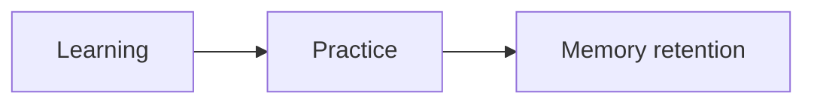
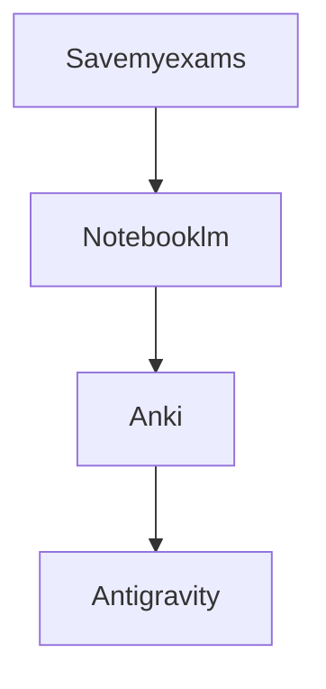

 
## TL;DR: Cards First, Always
1. **Practice is Priority #1:** Past papers validate everything.

---

## The NotebookLM Source Stack

_Load these once. Don't change them mid-exam prep._

1. **The Specification:** Official syllabus. Keeps the AI on topic.
2. **Question Format Source:** Past paper mark schemes and ideal answer templates.
3. The Weakness Source

---

## The Priority Stack (What Happens When)

Two anchors, not a calendar. A calendar breaks the day it gets disrupted, because it's tied to dates. A priority stack doesn't, because it's tied to state.

**Morning anchor (fixed, already works):** Open Anki. Physics + Bangla vocab. No decision — the queue already tells you what's due.

**Evening anchor:** Same clock time every day, tied to something that already happens without fail (after dinner / right after coaching). What fills the slot is decided by this order, not by the day of the week:
1. Whichever coaching subject (Maths B / FPM / Accounting) has homework due soonest — if something's due, it goes first, no choice involved.
2. Otherwise, whichever of English / Bangla practice / ICT was practiced longest ago.

**Disruption fallback (sick, out, anything):** minimum version = 10 minutes on whatever's most overdue. Not skipped, not rescheduled — just shrunk. Missing a day doesn't break the order, because nothing was tied to that day; the subject just stays "most overdue" until you're back.

**Entry action is pre-decided, not chosen in the moment:** the next past-paper page, question, or practice set is bookmarked/queued in advance, so starting the slot never requires deciding what to open first.

**Ownership rule:** this stack is yours to edit, not a rule imposed from outside. Reorder it when it stops matching reality. Following a stale version of your own rule out of guilt defeats the point of having one.

---
## The "Format-First" Flashcard (O-Level Mastery)

_Stop testing definitions. Start testing Answer Structure._

- **Card Front:** [Command Word] + [Topic] + [Mark Count] (e.g., _"Explain the causes of X (4 Marks)"_).
- **Card Back:**
    - **Structure:** (e.g., 2 Points + 2 "Because" links).
    - **Mark-Scheme Bold Words:** Keywords the examiner requires.
    - **Template:** A sample high-scoring sentence structure.

---

## Rules I Don't Break

- **Cards before everything.** Even on a bad day. Even if it's just 5.
- **Answer the Verb:** If the question says "Explain" and I only "Describe," I have failed.
- **Analogy is Mastery:** If you can't find an analogy for a card, you haven't owned the logic yet.
- **The 5-Card Start:** If the mountain is too high, just do 5 cards. Momentum is everything.
- ~~**Cap reviews at 50 cards/day**~~ → Stop when confused or exhausted, not at an arbitrary number.
- ~~**Earn the Card**~~ → Cards are the starting point, not the reward.

---

## What Each Tool Actually Does

| Tool           | Job                                                                                                                                               |
| -------------- | ------------------------------------------------------------------------------------------------------------------------------------------------- |
| **Anki**       | Entry point + external executive function. Red Flags = your live Weakness Log.                                                                    |
| **NotebookLM** | On-demand gap closer. Only open it after Anki surfaces a confusion.                                                                               |
| **Notion**     | Mastery tracker — updated immediately after sessions. - outdated may consider coming back to because of student plan and some other useful things |
rom what i know studying happens in three stages 

# Tools Stack

# Research Core 
The main goal here to create a proper independent study loop leveraging ai (gemini + notebooklm), combining proven adhd friendly methods with accommodating for excutive dysfunction reducing friction to get started and learning in a hyper focused subject teaching 
# Study Concepts
- **Use study aids:** Use flashcards, quizzes, or online learning platforms to facilitate interleaved practice. Many study tools allow you to shuffle questions or topics, making it easy to interleave your practice.
- **Monitor progress:** Track your progress and adjust your interleaving strategy as needed. You can adjust your study schedule to allocate more time if certain topics or skills require more attention.
### Concepts i want to use 
- anki flashcards for space repetition plus memory repetition
- notebooklm and antigravitiy with grill me to find out the mindmap for weakness for  igcse with specification sheet 
- specific questions from pastpapers (markdown format for mark it down) from the weakness chart 
- issue tracker for questions

**Sources:**
- [Interleaving for deeper learning](https://www.coursera.org/articles/interleaving)
- [Cognitive science of interleaving](https://www.justinmath.com/cognitive-science-of-learning-interleaving/)
- [Using mark schemes and examiner reports effectively](https://latimertuition.com/ed-centre/students/exam-technique/how-to-use-mark-schemes)
- [Examiner reports for pattern recognition](https://vaceglobal.com/using-examiner-reports/)
- [Extensive reading and reading speed](https://tortolingua.com/blog/extensive-reading-language-learning/)
- [Rules for designing precise Anki cards](https://controlaltbackspace.org/precise/)
- [Cloze deletion best practices](https://www.ollielovell.com/anki3/)
```query
#topic/study  
```


